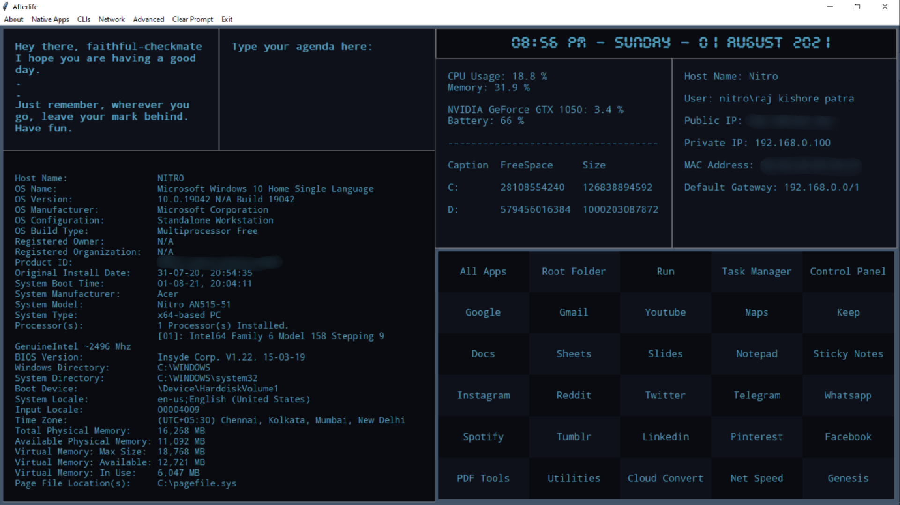

## Afterlife

Afterlife is a minimalistic HUD.

It brings all the important functions/commands of Windows to its users and helps them work effortlessly.

### Usage
```
git clone https://github.com/raj-patra/afterlife.git
pip install -r requirements.txt

cd afterlife

py afterlife.py
```

### Screenshots

