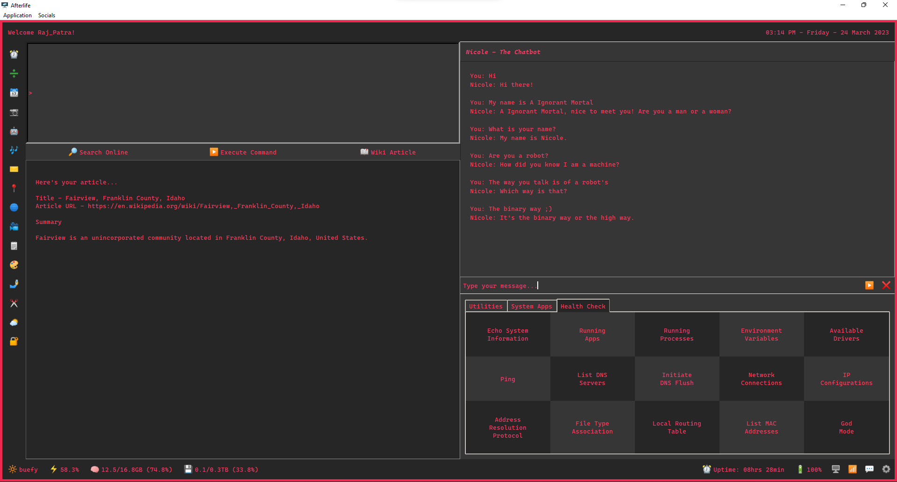

## Afterlife

Afterlife is a minimalistic HUD.

It brings all the important functions/commands of Windows to its users and helps them work effortlessly.

### Usage
```
# Cloning the Repo
git clone https://github.com/raj-patra/afterlife.git

# Installing the requirements for the application
pip install -r requirements.txt

# Traversing into the project directory
cd afterlife

# Running the application
py afterlife.py
```

### Screenshots

